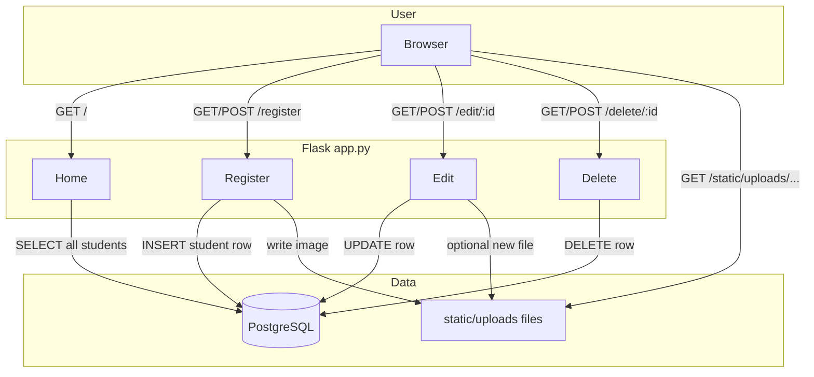

# Student Management — Logic Flow and Architecture

This document explains how the Flask **Student management** app is structured, what each part does, and how a request moves through the system.

---

## 1. Purpose of the application

The app lets you:

- **Register** students (name, email, academic fields, phone, and optional profile photo)
- **List** all students on the home page
- **Edit** a student and optionally replace the photo
- **Delete** a student

Data is stored in **PostgreSQL** via **Flask-SQLAlchemy**. Images are stored as files on disk under `static/uploads/` and only the **filename** is saved in the database (so the browser can request `/static/uploads/<filename>`).

---

## 2. Main technologies

| Piece | Role |
|--------|------|
| **Flask** | Web framework: routes, requests, responses, `render_template`, `redirect`, `url_for`, `flash` |
| **Flask-SQLAlchemy** | Maps Python classes to database tables; `db.session` for add/commit/delete |
| **PostgreSQL** | Database; connection string in `app.config['SQLALCHEMY_DATABASE_URI']` |
| **Jinja2** (in templates) | HTML with `{{ }}` and ``: loops, conditions, `url_for` for correct URLs |
| **Werkzeug** `secure_filename` | Sanitizes upload filenames to avoid path traversal and odd characters |

---

## 3. Project layout (what lives where)

```
Student_management/
├── app.py                 # App factory config, all HTTP routes, upload handling
├── models.py              # SQLAlchemy `db` and `Student` model
├── static/
│   └── uploads/           # Image files (created on first upload if missing)
└── templates/
    ├── home.html          # List students + action links
    ├── register.html      # Registration form
    └── edit.html          # Edit form + current photo
```

---

## 4. Data model: `Student`

Each row in the `student` table (name chosen by SQLAlchemy from the class `Student`, usually `student` in the DB) represents one student.

| Field | Type (approx.) | Meaning |
|--------|-----------------|---------|
| `id` | Integer, primary key | Auto-increment; used in `/edit/<id>` and `/delete/<id>` |
| `name` | String | Student name |
| `email` | String | Email |
| `roll_number` | String | Roll number |
| `semester` | String | Semester |
| `batch` | String | Batch |
| `mobile_number` | String | Mobile |
| `photo` | String, optional | **Only the file name** (e.g. `photo.jpg`), not a full path |

**Why only the filename?**  
Flask serves static files from the `static/` folder. The URL is built with `url_for('static', filename='uploads/' + name)`, which becomes `/static/uploads/photo.jpg`. Storing a full path like `static/uploads/photo.jpg` in the same field and *also* prefixing `uploads/` in the template would break the URL (double path).

The `__init__` in `models.py` is used when the app does `Student(..., photo=db_photo)`.

---

## 5. Application startup and configuration (logical flow)

```text
1. Create Flask app: app = Flask(__name__)
2. Set SQLALCHEMY_DATABASE_URI → PostgreSQL
3. Set SECRET_KEY → needed for signed flash messages
4. Set UPLOAD_FOLDER = 'static/uploads'
5. db.init_app(app) → connect SQLAlchemy to this app
6. On first run (or via CLI), tables must exist: flask init-db  →  create_all()
7. app.run() starts the dev server (when you run app.py)
```

**CLI: `flask init-db`**  
The `@app.cli.command("init-db")` command runs `db.create_all()` to create tables if they are missing. You do this after configuring the correct database URL.

---

## 6. High-level request–response flow

```text
Browser  →  HTTP request (path + method + form/files)
         →  Flask matches @app.route
         →  View function runs (query DB, read form, save files)
         →  Response: either HTML (render_template) or redirect (after POST)
         →  Browser
```

- **GET** usually shows a form or a list.
- **POST** usually changes data; the pattern “POST → process → `redirect` to GET” is **Post/Redirect/Get**, which avoids duplicate submits on refresh and allows flash messages to show once on the next page.

---

## 7. Route-by-route logic

### 7.1 `GET /` — `home()`

1. `Student.query.all()` loads every student from the database.
2. Renders `home.html` and passes `students` into the template.
3. The template loops over `students` and, for each row, shows `student.photo` as an image using `url_for('static', filename='uploads/…')` (with Jinja logic to handle only a filename *or* legacy `static/uploads/...` strings if old data still exists).
4. Flash messages (if any) are shown with `get_flashed_messages()`.

**Empty list:** the template can show a “no students” message instead of a table.

---

### 7.2 `GET/POST /register` — `register()`

| Step | When | What happens |
|------|------|----------------|
| 1 | `GET` | Renders `register.html` (empty form). |
| 2 | `POST` | Reads all text fields from `request.form`. |
| 3 | `POST` | Reads `request.files['photo']`. If the file is present and has a `filename`, `secure_filename` runs, the `static/uploads` directory is created if needed, the file is saved to disk, and **only the filename** is kept as `db_photo`. Otherwise `db_photo` is `None`. |
| 4 | `POST` | `Student(...)` is created, `db.session.add`, `commit()`. |
| 5 | `POST` | `flash` success, `redirect(url_for('home'))`. |
| 6 | Error in `try` | `flash` the error, `redirect` to register. |

**Note:** The form must use `enctype="multipart/form-data"` so the file is included in the POST body.

---

### 7.3 `GET/POST /edit/<id>` — `edit_student(id)`

1. `Student.query.get_or_404(id)` — if no row has that `id`, Flask returns 404.
2. **`GET`:** Renders `edit.html` with that `student` (pre-filled fields + current image if any).
3. **`POST`:** Overwrites the student’s text fields from the form. If a new file was uploaded (`photo` and `photo.filename`), it saves the file like on register and sets `student.photo` to the new filename. If the user does not pick a new file, the old `photo` value is left unchanged. Then `commit()`, flash, redirect to home.

---

### 7.4 `GET/POST /delete/<id>` — `delete_student(id)`

1. Loads the student or 404.
2. Deletes the row: `db.session.delete(student)`, `commit()`.
3. Flashes a message and redirects to home.

**Note:** This does not delete the image file on disk; only the database row is removed. That is a possible future improvement (delete file in `os.remove` if you want a clean upload folder).

---

## 8. How photos and static URLs work together

1. On disk, files live in **`static/uploads/<filename>`** (relative to the project).
2. Flask’s static system maps the URL path **`/static/...`** to files in the **`static/`** directory.
3. So **`/static/uploads/photo.jpg`** is the file **`static/uploads/photo.jpg`**.
4. In templates, you should not hardcode `/static/...`; use **`url_for('static', filename='uploads/' + name)`** so the base URL and app root stay correct.
5. **`secure_filename()`** makes the stored name safe (e.g. strips dangerous path segments from the client-provided name).

```text
[Register/Edit]  →  save file to static/uploads/<secure name>
                 →  store <secure name> in DB

[Home/Edit]      →  read name from DB
                 →  build URL: url_for('static', filename='uploads/' + name)
                 →    requests the file
```

---

## 9. End-to-end diagram (mermaid)



---

## 10. Flash messages

- `flash("...")` stores a one-time message in the session (requires `SECRET_KEY`).
- The next response that renders a template and calls `get_flashed_messages()` in the template will show the message, then it is cleared.

This is why redirect after POST is common: the user sees the list page **with** a single “Success” (or error) line.

---

## 11. Security and operations notes (short)

- **SECRET_KEY** in the repo is for development; use an environment variable in production and never commit real secrets.
- **Database URL** (password) should also come from environment variables in production.
- **Upload size / type** are not limited in the shown code; for production, consider max content length and only allowing real image types (e.g. by inspecting content or whitelisting extensions after `secure_filename`).

---

## 12. Glossary (quick)

| Term | Meaning here |
|------|----------------|
| **Route** | URL path + HTTP method, attached to a Python function. |
| **View** | That Python function (e.g. `home`, `register`). |
| **Template** | Jinja2 HTML in `templates/`, filled with variables. |
| **Model** | `Student` class = one table’s structure. |
| **Session (flash)** | Short-lived data between redirect and the next request; not the same as user login. |

---

*Generated for the Student_management project. Update this file if you add authentication, validation, or new routes.*
